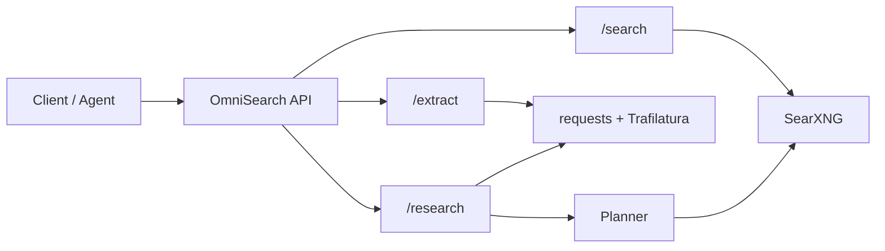

# OmniSearch

中文说明见 [README.zh-CN.md](README.zh-CN.md)。

OmniSearch is a minimal local-first search tool layer for AI agents.

This project is not a search engine. It exposes one unified FastAPI service and uses:

- `/search` backed by SearXNG
- `/extract` backed by `requests` + Trafilatura
- `/research` as a minimal search + extract orchestration

The intended usage is:

- you only call OmniSearch on the OmniSearch API port, `8000` by default
- SearXNG runs as an internal dependency for `/search`
- you do not need to call SearXNG directly

This repository includes a local SearXNG config that enables `json` responses, so OmniSearch can call `/search?format=json` without additional manual setup.

## Requirements

- Python 3.11+
- Docker and Docker Compose for the bundled SearXNG setup

## Project Structure

```text
app/
  api/
  core/
  extractors/
  providers/
  research/
  schemas/
```

## One-Command Start

The simplest way to run the MVP is:

```bash
make up
```

If you do not want to use `make`, the equivalent command is:

```bash
docker compose up --build
```

This starts:

- OmniSearch API on `http://localhost:8000` by default
- SearXNG on `http://localhost:8080` by default

The API container is now built from the local [Dockerfile](Dockerfile), instead of installing dependencies at runtime inside a generic Python image.

You should only send requests to OmniSearch on the API port.

## Local Setup

Use this mode if you want to run FastAPI directly on your machine and only use Docker for SearXNG.

1. Create the env file:

```bash
cp .env.example .env
```

2. Install dependencies:

```bash
python -m venv .venv
source .venv/bin/activate
pip install -r requirements.txt
```

3. Start SearXNG:

```bash
docker compose up -d searxng
```

If you changed SearXNG configuration, restart it with:

```bash
docker compose up -d --force-recreate searxng
```

4. Start the API:

```bash
uvicorn app.main:app --reload
```

The API will be available at `http://localhost:8000`.

If you change ports in `.env`, use the updated values instead.

In this local mode, `SEARXNG_BASE_URL` should stay as:

```env
SEARXNG_BASE_URL=http://localhost:8080
```

The current research planner can be configured with:

```env
RESEARCH_PLANNER=rule
```

Optional LLM planner settings:

```env
OPENAI_API_KEY=
OPENAI_BASE_URL=
RESEARCH_PLANNER_MODEL=gpt-5
```

Supported values today:

- `rule`: deterministic local rule-based planner
- `llm`: model-backed planner mode; if the model call fails or no API key is configured, it safely falls back to the rule planner

The current LLM planner uses an OpenAI-compatible `chat/completions` request shape and then falls back to the rule planner if the model call fails.

## Architecture

The runtime shape of the MVP is:

```text
Client / Agent
  -> OmniSearch API (FastAPI, port 8000)
       -> SearXNG (search provider)
       -> requests + Trafilatura (content extraction)
```



Responsibilities are intentionally narrow:

- OmniSearch provides a stable API layer
- SearXNG provides search results
- Trafilatura extracts page content

No indexing, ranking model, auth, billing, dashboard, or extra infrastructure is included.

## API Examples

### Healthcheck

```bash
curl http://localhost:8000/health
```

### Search

```bash
curl -X POST http://localhost:8000/search \
  -H "Content-Type: application/json" \
  -d '{
    "query": "fastapi searxng",
    "top_k": 5
  }'
```

### Extract

```bash
curl -X POST http://localhost:8000/extract \
  -H "Content-Type: application/json" \
  -d '{
    "url": "https://example.com"
  }'
```

### Research

```bash
curl -X POST http://localhost:8000/research \
  -H "Content-Type: application/json" \
  -d '{
    "query": "latest fastapi release notes",
    "top_k": 3
  }'
```

`/research` currently does the simplest useful flow:

- call `/search`
- keep trying candidate pages until enough successful extracts are collected or candidates are exhausted
- return aggregated results

It does not include summarization or reranking.

The response includes:

- `generated_queries`: the normalized and expanded queries used internally
- `search_results_count`: how many search results were returned before extraction
- `search_debug`: per-query search counts and provider errors for debugging
- `items`: the extracted research items, with per-item errors when extraction fails

## Demo

Minimal local demo flow:

1. Search:

```bash
curl -X POST http://localhost:8000/search \
  -H "Content-Type: application/json" \
  -d '{"query":"fastapi","top_k":3}'
```

2. Extract:

```bash
curl -X POST http://localhost:8000/extract \
  -H "Content-Type: application/json" \
  -d '{"url":"https://fastapi.tiangolo.com/"}'
```

3. Research:

```bash
curl -X POST http://localhost:8000/research \
  -H "Content-Type: application/json" \
  -d '{"query":"fastapi tutorial","top_k":2}'
```

## Notes

- This project is a search tool layer, not a search engine.
- No indexing, ranking model, auth, billing, dashboard, or extra infrastructure is included in this stage.
- `/extract` returns markdown only when Trafilatura can extract readable content from the target page.
- In Docker Compose mode, the API talks to SearXNG over the internal container network.

## Open Source Notes

Recommended default for this repository:

- license your OmniSearch source code separately
- treat SearXNG as a third-party dependency, not as your own code
- do not copy SearXNG source files into this repository

Key third-party licenses used in this MVP include:

- FastAPI: MIT
- requests: Apache-2.0
- trafilatura: Apache-2.0
- pydantic-settings: MIT
- SearXNG: AGPL-3.0

See [THIRD_PARTY_NOTICES.md](THIRD_PARTY_NOTICES.md) for a concise dependency notice file.
