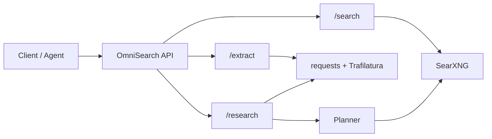

# OmniSearch

English version: [README.md](README.md)

OmniSearch 是一个面向 AI Agent 的、本地优先的搜索工具层 MVP。

它不是搜索引擎，不做全网索引。当前版本只提供一个统一的 FastAPI 服务，并集成：

- `/search`：通过 SearXNG 搜索网页
- `/extract`：通过 `requests + trafilatura` 抽取网页正文
- `/research`：最小可用的 search + extract 编排接口

## 使用方式

推荐把 OmniSearch 理解为“统一 API 层”：

- 你只需要调用 OmniSearch API，默认端口是 `8000`
- SearXNG 是 `/search` 的内部依赖
- 正常使用时不需要直接调用 SearXNG

仓库里已经自带一份本地 SearXNG 配置，默认开启 `json` 响应，这样 OmniSearch 才能直接调用 `/search?format=json`。

运行结构如下：

```text
Client / Agent
  -> OmniSearch API (FastAPI)
       -> SearXNG
       -> requests + Trafilatura
```



## 项目结构

```text
app/
  api/
  core/
  extractors/
  providers/
  research/
  schemas/
```

## 一键启动

最简单的启动方式：

```bash
make up
```

如果不使用 `make`，也可以直接运行：

```bash
docker compose up --build
```

默认会启动两个服务：

- OmniSearch API：`http://localhost:8000`
- SearXNG：`http://localhost:8080`

其中 API 容器现在会通过本地的 [Dockerfile](Dockerfile) 构建，而不是在通用 Python 镜像里运行时再临时安装依赖。

注意：对外你只需要访问 OmniSearch API。

## 本地开发模式

如果你想直接在本机运行 FastAPI，而只用 Docker 启动 SearXNG，可以按下面步骤：

1. 创建环境变量文件

```bash
cp .env.example .env
```

2. 安装依赖

```bash
python -m venv .venv
source .venv/bin/activate
pip install -r requirements.txt
```

3. 启动 SearXNG

```bash
docker compose up -d searxng
```

如果你改过 SearXNG 配置，需要强制重建：

```bash
docker compose up -d --force-recreate searxng
```

4. 启动 API

```bash
uvicorn app.main:app --reload
```

默认情况下，API 地址为：

```text
http://localhost:8000
```

如果你修改了 `.env` 里的端口配置，请按修改后的端口访问。

本地开发模式下，建议保留：

```env
SEARXNG_BASE_URL=http://localhost:8080
```

当前 research planner 可以通过下面配置控制：

```env
RESEARCH_PLANNER=rule
```

可选的 LLM planner 配置：

```env
OPENAI_API_KEY=
OPENAI_BASE_URL=
RESEARCH_PLANNER_MODEL=gpt-5
```

当前支持的值：

- `rule`：本地规则版 planner
- `llm`：模型规划模式；如果没有配置 API Key，或模型调用失败，会安全回退到规则版 planner

当前 `llm` planner 使用 OpenAI-compatible 的 `chat/completions` 请求格式；如果模型调用失败，会回退到规则版 planner。

## 环境变量

参考 [.env.example](.env.example)：

```env
API_PORT=8000
SEARXNG_BASE_URL=http://localhost:8080
SEARXNG_PORT=8080
RESEARCH_PLANNER=rule
OPENAI_API_KEY=
OPENAI_BASE_URL=
RESEARCH_PLANNER_MODEL=gpt-5
REQUEST_TIMEOUT=15
USER_AGENT=OmniSearch/0.1
```

## API 示例

### 健康检查

```bash
curl http://localhost:8000/health
```

### 搜索网页

```bash
curl -X POST http://localhost:8000/search \
  -H "Content-Type: application/json" \
  -d '{
    "query": "fastapi searxng",
    "top_k": 5
  }'
```

返回字段统一为：

- `title`
- `url`
- `snippet`
- `source`
- `score`

### 抽取正文

```bash
curl -X POST http://localhost:8000/extract \
  -H "Content-Type: application/json" \
  -d '{
    "url": "https://example.com"
  }'
```

返回字段统一为：

- `title`
- `url`
- `markdown`
- `published_date`
- `domain`

### Research 接口

```bash
curl -X POST http://localhost:8000/research \
  -H "Content-Type: application/json" \
  -d '{
    "query": "latest fastapi release notes",
    "top_k": 3
  }'
```

当前实现的是最小可用流程：

- 先搜索
- 再按候选结果继续逐条抽取正文，直到尽量凑满成功结果或候选耗尽
- 最后返回聚合结果

返回里会额外带上：

- `generated_queries`：内部实际用于搜索的拆词/扩展 query 列表
- `search_results_count`：搜索阶段实际返回了多少条结果
- `search_debug`：每个 query 的搜索结果数和错误信息，方便排查
- `items`：逐条聚合后的结果；如果某一条抽取失败，会带该条的 `error`

## Demo

本地最小演示流程：

1. 搜索：

```bash
curl -X POST http://localhost:8000/search \
  -H "Content-Type: application/json" \
  -d '{"query":"fastapi","top_k":3}'
```

2. 抽取正文：

```bash
curl -X POST http://localhost:8000/extract \
  -H "Content-Type: application/json" \
  -d '{"url":"https://fastapi.tiangolo.com/"}'
```

3. Research：

```bash
curl -X POST http://localhost:8000/research \
  -H "Content-Type: application/json" \
  -d '{"query":"fastapi tutorial","top_k":2}'
```

当前还不包含：

- LLM 总结
- rerank
- 去重策略
- 复杂并发控制

## 当前范围

这一阶段只做最小可运行版本，目标是：

- 本地能启动
- `/search` 能返回搜索结果
- `/extract` 能返回正文 markdown
- `/research` 接口存在
- 文档和 Docker Compose 可用

当前明确不做：

- 自建搜索引擎
- 全网索引
- 排序模型
- 鉴权
- 用户系统
- 多租户
- 计费
- 管理后台
- Redis
- Playwright
- 复杂缓存
- LLM 总结逻辑

## 开源说明

建议把 OmniSearch 作为独立项目开源，同时明确第三方依赖边界：

- OmniSearch 自身代码使用仓库内声明的许可证
- SearXNG 是第三方依赖，不是 OmniSearch 自己的代码
- 不要把 SearXNG 源码直接拷贝进本仓库

当前主要依赖许可证包括：

- FastAPI：MIT
- requests：Apache-2.0
- trafilatura：Apache-2.0
- pydantic-settings：MIT
- SearXNG：AGPL-3.0

第三方依赖说明见 [THIRD_PARTY_NOTICES.md](THIRD_PARTY_NOTICES.md)。

## 说明

- 这是搜索工具层，不是搜索引擎
- 当前实现优先保证简单、清晰、可本地运行
- Docker Compose 模式下，OmniSearch 会通过容器内网络访问 SearXNG
